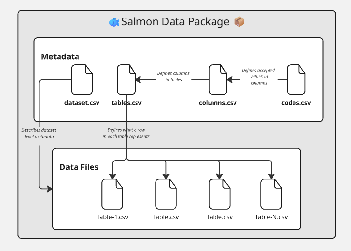

# Salmon Data Package (SDP) README

A lightweight specification for exchanging salmon datasets between scientists, assessment biologists, and data stewards.

## Overview

The **Salmon Data Package (SDP)** is designed to:

- Be **simple to adopt** with Excel and CSV files
- Be **tool-friendly** for R/Python packages and custom GPT assistants
- Be **ontology-aware**, linking columns and codes to the **DFO Salmon Ontology** and related vocabularies
- Use a CSV-canonical custom Frictionless Data Package profile with Tabular Data Resource resources

Each SDP instance is a small directory of CSV data files and metadata CSVs that describe the dataset, tables, columns, and controlled codes. Publication-ready packages include a generated `datapackage.json` descriptor that declares the SDP custom Frictionless profile and agrees with the canonical CSV metadata.

**Integration context:** See the [Salmon Data Integration System overview page](https://br-johnson.github.io/salmon-data-integration-system/) and [walkthrough video](https://youtu.be/B0Zqac49zng?si=VmOjbfMDMd2xW9fH).

## Schema screenshot



## Role boundary (to avoid source-of-truth confusion)

This repo defines the **specification** and examples for SDP validity.

- Canonical rules: `SPECIFICATION.md` in this repo.
- Project-specific assessment artifacts (for example SPSR mappings and proposed terms) should live in the project assessment repo/workspace (currently `Br-Johnson/smn-data-gpt/assessments/spsr` for SPSR), not here.

## What's Made Possible by Adopting SDP

Adopting the Salmon Data Package specification enables a range of capabilities for data integration, automation, and interoperability:

### 🔍 **Machine-Aided Data Integration**
- **Automated Validation**: Validate data structure, types, and semantic alignment automatically
- **Cross-Dataset Linking**: Link related datasets using shared ontology terms and controlled vocabularies
- **Semantic Querying**: Query across datasets using ontology terms (e.g., "find all escapement measurements")
- **Data Discovery**: Discover related datasets through shared vocabulary and ontology links

### 🤖 **AI and Automation Support**
- **GPT Assistant Integration**: Custom GPT assistants can understand your data structure and help with analysis
- **Automated Documentation**: Generate data dictionaries and documentation from metadata
- **Code Generation**: Automatically generate R/Python code to read and validate your data
- **Metadata Extraction**: Tools can extract and validate metadata from existing datasets

### 🔗 **Interoperability and Standards Alignment**
- **Custom Frictionless Profile**: Publish SDP packages as a custom Frictionless Data Package profile using Tabular Data Resource resources
- **Darwin Core Integration**: Map to Darwin Core terms for biodiversity data portals (e.g., GBIF)
- **FAIR Data Principles**: Achieve Findable, Accessible, Interoperable, and Reusable data
- **Web Discoverability**: JSON-LD exports can enable discovery via Google Dataset Search

### 📊 **Enhanced Data Quality**
- **Controlled Vocabularies**: Enforce consistent codes and values across datasets
- **Type Validation**: Ensure data types match declared schemas
- **Relationship Validation**: Validate foreign keys and table relationships
- **Semantic Validation**: Verify that ontology terms and IRIs are valid and appropriate

### 🔄 **Workflow Automation**
- **Package Generation**: Automatically generate SDP packages from existing databases or spreadsheets
- **Format Conversion**: Convert between SDP and other formats (Darwin Core Archive, EML, etc.)
- **Version Control**: Track dataset versions and changes through metadata
- **Reproducible Analysis**: Share complete data packages with all metadata for reproducible research

### 🌐 **Semantic Web Integration**
- **Knowledge Graphs**: Build knowledge graphs linking salmon data across organizations
- **Linked Data**: Enable linked data queries across multiple SDP packages
- **Ontology Reasoning**: Use ontology reasoners to infer relationships and validate data
- **Cross-Domain Integration**: Link salmon data with environmental, taxonomic, and other domain data

### 👥 **Collaboration and Sharing**
- **Self-Documenting Data**: Data packages include all necessary documentation
- **Reduced Communication Overhead**: Clear metadata reduces need for back-and-forth questions
- **Standardized Exchange**: Consistent format enables easy data sharing between teams
- **Repository Integration**: Publish to data repositories (Zenodo, Figshare, DataONE) with full metadata

### 🛠️ **Tooling Ecosystem**
- **R Package Support**: Use `metasalmon` R package for reading, validating, and working with SDP packages
- **Python Support**: Python libraries can easily parse and validate SDP packages
- **Validation Tools**: Command-line and programmatic validation tools
- **Template Generation**: Generate SDP package templates for new projects

## Quick Start

- Follow `docs/quickstart.md` for the step-by-step walkthrough.
- Download and fill in `templates/salmon-data-package-template.zip` for a blank package template.
- Use `examples/minimal-example/` as a template for the canonical `metadata/` + `data/` package layout.
- Use the Frictionless Table Schema files under `schema/frictionless/metadata/` as the authoritative metadata schemas, and `docs/field-reference.md` for a generated field reference.
- Use `SPECIFICATION.md` for the rules that define validity.
- Run `python3 scripts/validate_package.py examples/minimal-example` for strict publication validation once dependencies from `requirements.txt` are installed.

For I-ADOPT (a standard for describing variables by parts) guidance and IRI (a web identifier that points to a concept on the internet) sources, see `docs/i-adopt-integration-guide.md` and the I-ADOPT terminology catalogue UI at https://i-adopt.github.io/terminologies/ (role-by-role vocabulary browser).

For EDH/GeoNetwork exporter implementation guidance, see `docs/edh-hnap-mapping.md`.

## Project Structure

```text
sdp-spec/
├── README.md               # This file
├── SPECIFICATION.md        # Concise specification (rules that define validity)
├── schema/
│   ├── frictionless/
│   │   └── metadata/       # Authoritative Frictionless Table Schemas
│   └── sdp.rules.yaml      # SDP rules not expressible as Table Schema fields
├── profiles/
│   └── salmon-data-package/
│       └── v0.2/
│           └── profile.json # SDP Frictionless package profile
├── templates/
│   ├── salmon-data-package-template/
│   └── salmon-data-package-template.zip
├── template-source/
│   └── salmon-data-package-template/
│       └── README.md      # Human-authored source for the generated template README
├── docs/                   # Guides and background documentation
│   ├── field-reference.md  # Generated from Frictionless metadata schemas
│   ├── quickstart.md       # Exporter-first setup and package assembly
│   ├── edh-hnap-mapping.md # SDP dataset metadata to HNAP XML mapping guidance
│   └── ...                 # Additional non-normative implementation guides
├── examples/               # Example packages
│   └── minimal-example/
│       ├── datapackage.json
│       ├── metadata/
│       ├── data/
│       └── README.md
├── CHANGELOG.md            # Version history
├── LICENSE                 # License terms
└── .github/
    └── workflows/          # CI/CD workflows
```

## Related Projects

- **[metasalmon](https://github.com/DFO-PacSci/metasalmon)** - R package for reading, validating, and working with SDP packages
- **[dfo-salmon-ontology](https://github.com/DFO-PacSci/dfo-salmon-ontology)** - DFO Salmon Ontology providing semantic definitions

## Versioning

This specification uses semantic versioning (e.g., `sdp-1.0.0`). See [CHANGELOG.md](CHANGELOG.md) for version history.

## Contributing

Issues, proposals, and clarifications are tracked via GitHub Issues. For major changes, please open an issue first to discuss.

To revise the README included in the downloadable template, edit `template-source/salmon-data-package-template/README.md`, then run `python3 scripts/generate_artifacts.py --write`.

## License

See [LICENSE](LICENSE) file for details.

## Contact

**Author**: Brett Johnson, Data Stewardship Unit (DFO Pacific Region Science Branch)
